<table>
<tr>
<td valign="top"></td>
<td valign="top"></td>
</tr>
</table>

### About

Software engineer who treats code as the last step, not the first. I start from requirements and system design, build with maintainable architecture, and own quality through testing, QA and release. Currently at **Sanal**, working on AI-to-AI commerce infrastructure, shipping the consumer app on iOS and Android, and running the pre-release QA process for the engineering team.

### Featured Projects

| Project | What it is | Stack |
|---|---|---|
| [Sharih](https://github.com/8cy7/sharih) | Arabic AI study platform that turns PDFs into narrated lessons, videos and quizzes | Next.js, TypeScript, LLM agents |
| [Names of Allah](https://github.com/8cy7/names-of-allah) | iOS app for learning the 99 Names, previously published on the App Store | Swift, SwiftUI |
| [Motivito](https://github.com/8cy7/Motivito) | Gamified task app for children with a parent dashboard (graduation project) | React Native, Node.js, Prisma |
| [Portfolio](https://github.com/8cy7/8cy7.github.io) | My personal website with project case studies | Next.js, React, TypeScript, Tailwind |
| [Paradise Nursery](https://github.com/8cy7/paradisenursery) | Plant shop with cart and state management | React, Redux Toolkit |
